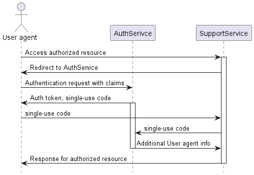

# AuthService and SupportService communication specifications

Communication between `AuthService` and `SupportService` will rely
on single-use code,provided by `AuthService` to user agent.
`SupportService` uses that single-use code to obtain additional
info about user agent to perform actions.

Source: [External Authentication Services with ASP.NET Web API (C#)](https://learn.microsoft.com/en-us/aspnet/web-api/overview/security/external-authentication-services)

`AuthService` can use any authentication mechanism behind the scenes,
but that mechanism involves only user agent and `AuthService`.
`SupportService` doesn't know anything about `AuthService` authorization implementation.

The next diagram describes concrete algorithm of communication
between `AuthService` and `SupportService`:

With response from `AuthService` descibed as follows:

`authToken` in this response is only valid in `AuthService` scope.
This code is used for obtaining single-use code.

Single use code must be long enough to prevent unauthorized access to user data.

To prevent brute-forcing this code, request limiters must be used.

